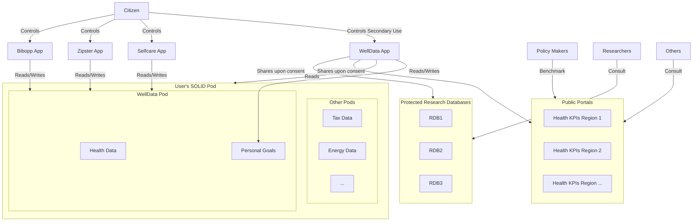

# WellData App Prototype based on a Community SOLID Server

# WellData App and Ecosystem

The aim is to have one app called **WellData**, but since it is complex, there are also other apps that demonstrate partial steps towards that WellData app. 

## Purpose of WellData

The **WellData** app aims to enable citizens to manage their own preventive health data in a **SOLID Pod**, while also enabling **secondary use** of such data. Secondary use is foreseen for **policy makers** as well as **researchers**. 

> **Note:** The secondary use features are still on the roadmap at the time of writing.

## Future Functionalities

In the near future, the WellData app will be augmented with the following functionalities:

### Anonymous Landing Page
- The **anonymous landing page** should provide **two leaderboards**:
  1. **Leaderboard 1**: Designed to **promote user onboarding**, encouraging individuals to gain control over their data and receive better support for maintaining a healthy lifestyle socially. Initially, this leaderboard will contain **mock data**.
  2. **Leaderboard 2**: Designed to **promote data solidarity** towards policy makers and researchers, while ensuring EU values on **health data sensitivity** and **citizen control** are upheld.  

- These leaderboards will **benchmark Belgian and Dutch cities** by:
  - **Leaderboard 1**: Showing the percentage of citizens connected to WellData.
  - **Leaderboard 2**: Showing the percentage of connected citizens who **support health data solidarity**.
  - **Cities without connected users will not appear in Leaderboard 2**.

### Signed-In Users
- Once **signed in**, the **leaderboards will no longer appear** on the landing page but remain accessible via a **menu item**.
- Instead, signed-in users will see a **landing page for managing personal goals**.
  - Initially, these goal lists are **empty**, but users can **add goals** from a selection of those **supported by the WellData system**.

## WellData Ecosystem

Each **goal** in the WellData system is supported by **one or more apps** connected to the WellData ecosystem. This ecosystem serves as a **prototype of a European Health Data Space** designed for **preventive health**.

### Initial Apps in the Ecosystem
The following apps will be **connected to this prototype implementation**:
- **[Selfcare](https://selfcare4me.com/)**
- **[Zipster](https://www.zipster.care/)**
- **[Bibopp](https://bibopp.be/)**

Each of these apps had **existing functionalities** before the construction of the WellData data space. However, thanks to the data space, they are now **connected via the user's SOLID Pod**, eliminating the need for **duplicate data entry**.



### Explanation:
- The **User's SOLID Pod** contains:
  - **Health Data** (managed by apps like Selfcare, Zipster, and Bibopp).
  - **Personal Goals** (set and updated by these apps).
- **Apps (Selfcare, Zipster, and Bibopp)**:
  - Can **read and write** both Health Data and Goals.
  - Avoid **duplicate data entry** by syncing via the Pod.
- **Secondary Use (Future Feature)**:
  - **Policy Makers** and **Researchers** may access **aggregated, user-controlled data** that is derived and then stored elsewhere.


## Author

**Pieter Van Gorp**
- GitHub: [@pvgorp](https://github.com/pvgorp)

## Features

- User authentication with OpenID Connect
- Container management (create, list, delete)
- File management within containers (create, list, delete)
- RDF-based file metadata using Dublin Core Terms vocabulary
- Modern, responsive UI

## Documentation

### Project Documentation
- [README.md](README.md) - This file, containing setup and usage instructions
- [TROUBLESHOOTING.md](TROUBLESHOOTING.md) - Solutions for common issues
- [docs/SERVER_PERSISTENCE.md](docs/SERVER_PERSISTENCE.md) - Information about server data persistence

### Application-Specific Documentation

#### SolidJS File Manager (app)
A very generic front-end for managing containers/files in a SOLID Pod.

- [app/README.md](app/README.md) - Setup and usage instructions for the SolidJS application
- [app/docs/COMPONENTS.md](app/docs/COMPONENTS.md) - Overview of key components and their interactions
- [app/docs/TECHNICAL_DETAILS.md](app/docs/TECHNICAL_DETAILS.md) - Detailed technical implementation

#### Extended version of app1, with some preliminary support to manage FHIR plans (app2)
- [app2/README.md](app2/README.md) - Setup and usage instructions for the React Chakra UI application
- [app2/docs/COMPONENTS.md](app2/docs/COMPONENTS.md) - Overview of key components and their interactions
- [app2/docs/TECHNICAL_DETAILS.md](app2/docs/TECHNICAL_DETAILS.md) - Detailed technical implementation

#### WellData Health Data Space Reference App (welldata)
- [welldata/README.md](welldata/README.md) - Setup and usage instructions for the WellData application
- [welldata/docs/COMPONENTS.md](welldata/docs/COMPONENTS.md) - Overview of key components and their interactions
- [welldata/docs/TECHNICAL_DETAILS.md](welldata/docs/TECHNICAL_DETAILS.md) - Detailed technical implementation

## Project Structure

- `/` - Root directory containing the SOLID server configuration
- `/app` - SolidJS application for managing files in a SOLID pod
- `/app2` - Alternative React application with Chakra UI
- `/welldata` - WellData application for managing health data in a SOLID pod
- `/scripts` - Utility scripts for managing client registrations and authentication

## Setup

1. Install dependencies:
```bash
# Install server dependencies
npm install

# Install first web app dependencies
cd app
npm install
cd ..

# Install second web app dependencies
cd app2
npm install
cd ..

# Install welldata app dependencies
cd welldata
npm install
cd ..
```

2. Start all components (server and all apps):
```bash
npm run dev
```

Alternatively, you can start components individually:

```bash
# Start the SOLID server
npm run start:server

# Start the first web application
npm run dev:app1

# Start the second web application
npm run dev:app2

# Start the welldata application
npm run dev:welldata
```

3. Access the applications:
   - First app: http://localhost:5173
   - Second app: http://localhost:5174
   - WellData app: http://localhost:5175

## Demo Applications Overview

This project showcases three different applications that can interact with the same Solid Pod, demonstrating the interoperability of Solid applications. The primary focus is on the WellData application, with the other two applications serving as simpler demonstrations of Solid Pod interaction:

### 1. SolidJS File Manager (app)
A file manager built with SolidJS that provides basic file and container management functionality. This application demonstrates:
- Using SolidJS with Solid Client libraries
- Basic file operations (create, read, delete)
- Container management
- Simple, functional UI

### 2. React Chakra UI Pod Manager (app2)
An alternative UI built with React and Chakra UI that provides a more modern interface for managing Solid Pods. This application demonstrates:
- Using React with Chakra UI for a modern interface
- The same functionality as the first app but with a different UI
- How multiple applications can access the same Pod

### 3. WellData Health Application (welldata)
The primary application in this project, designed to enable citizens to manage their own preventive health data in a SOLID Pod, while also enabling secondary use of such data for policy makers and researchers. This application demonstrates:
- Creating specialized containers for health data
- Implementing FHIR data structures in a Solid Pod
- Creating WebIDs for containers
- More advanced Solid features

The WellData application represents a prototype implementation of a European Health Data Space focused on preventive health. It aims to create a citizen-centric health data ecosystem where:
1. Citizens have full control over their preventive health data
2. Data can be shared across multiple health applications without duplication
3. Anonymized data can be used for research and policy-making with citizen consent

#### Future WellData Features
- **Leaderboards**: Promoting user onboarding and data solidarity
- **Personal Health Goals Management**: Interface for users to add and manage personal health goals
- **Connected App Ecosystem**: Integration with existing health applications like Selfcare, Zipster, and Bibopp

The first two applications (SolidJS File Manager and React Chakra UI Pod Manager) serve as simpler demonstrations of Solid Pod interaction, providing a foundation for understanding how the more complex WellData application works.

## Testing Multiple Applications with the Same Pod

This project demonstrates how multiple applications can authenticate and access the same Solid Pod, which is a key feature of the Solid ecosystem. All three applications use the same local WebID and Pod, but have completely different user interfaces and functionality.

To test this functionality:

1. Start all applications and the Solid server
2. Create a test account and Pod on the local Solid server
3. Log in to all applications using the same WebID
4. Make changes in one application (e.g., create a container)
5. Observe that the changes are visible in the other applications

This demonstrates the interoperability of Solid applications and how users can control their data while using multiple applications.

## Handling Authentication After Server Restarts

When the Solid server restarts, client registrations are typically lost, which can cause authentication errors. This project includes several solutions to address this issue:

### 1. Persistent Client IDs with npm Scripts

The client registration process is now integrated into the development workflow:

```bash
# Start everything with a single command (server, client registration, and apps)
npm run dev

# Or for minimal setup (just server, client registration, and welldata app)
npm run dev:minimal
```

The client registration script (`scripts/register-fixed-clients.sh`) is automatically executed as part of these commands, ensuring that client applications are properly registered with the Solid server before they start.

### 2. Clear Auth Data Button

All applications include a "Clear Auth Data" button that appears when you're logged in. This button:

- Clears all Solid-related authentication data from your browser's local storage
- Reloads the page so you can log in again with fresh credentials

Use this button when:
- You see authentication errors after restarting the server
- You want to switch to a different Solid identity provider
- You're experiencing other authentication issues

This provides a simple way to recover from authentication issues without having to manually clear local storage through browser developer tools.

### 3. Bookmarklet for Quick Clearing

For convenience, you can create a bookmarklet to clear Solid-related storage with a single click. See the [scripts README](./scripts/README.md) for instructions on setting up this bookmarklet.

## Local Development with Community Solid Server

### Setting Up Your Local WebID and Pod

For development purposes, it's recommended to use a locally generated WebID rather than an external one. This approach avoids CORS issues and simplifies the development process.

1. **Start the Community Solid Server**:
   ```bash
   npm start
   ```
   The server will run at http://localhost:3000

2. **Create a Test Account**:
   - Navigate to http://localhost:3000/.account/login/password/register/ in your browser
   - Register a new account with a username and password
   - After registration, you'll be logged in to your account dashboard

3. **Create a Pod**:
   - In your account dashboard, go to the "Pods" section
   - Click "Create Pod" and give it a name (e.g., "testpod")
   - The server will create a new Pod at http://localhost:3000/[pod-name]/

4. **WebID Generation**:
   - A WebID is automatically generated when you create a Pod
   - Your WebID will be available at http://localhost:3000/[pod-name]/profile/card#me
   - This WebID is fully configured and ready to use with your application

5. **Using Your Local WebID**:
   - When authenticating in your application, use http://localhost:3000 as the identity provider
   - Log in with your test account credentials
   - Your application will now be authenticated with your local WebID and can interact with your Pod

### Benefits of Using a Local WebID

- No CORS issues since everything is served from localhost
- Complete control over your WebID and Pod for testing
- Simplified authentication flow
- Full functionality without additional configuration

## Development

The project uses:
- Community Solid Server for the SOLID pod
- SolidJS and React for the web applications
- Inrupt Solid Client libraries for SOLID interactions
- TypeScript for type safety
- Vite for development and building

## Known Issues and Troubleshooting

This project has a few known issues:

1. **File Updates in Welldata Container**: There's a known issue with updating files in the welldata container, particularly the initial-plan.ttl file, which may result in 412 Precondition Failed errors.

2. **Client Credentials Issues**: The SOLID server sometimes reverts to using old client credentials, causing "accountID mismatch" errors during login attempts.

For detailed information about these issues and their workarounds, please refer to the [Troubleshooting Guide](./TROUBLESHOOTING.md).

## License

Copyright 2024 Pieter Van Gorp

Licensed under the Apache License, Version 2.0 (the "License");
you may not use this file except in compliance with the License.
You may obtain a copy of the License at

    http://www.apache.org/licenses/LICENSE-2.0

Unless required by applicable law or agreed to in writing, software
distributed under the License is distributed on an "AS IS" BASIS,
WITHOUT WARRANTIES OR CONDITIONS OF ANY KIND, either express or implied.
See the License for the specific language governing permissions and
limitations under the License. 