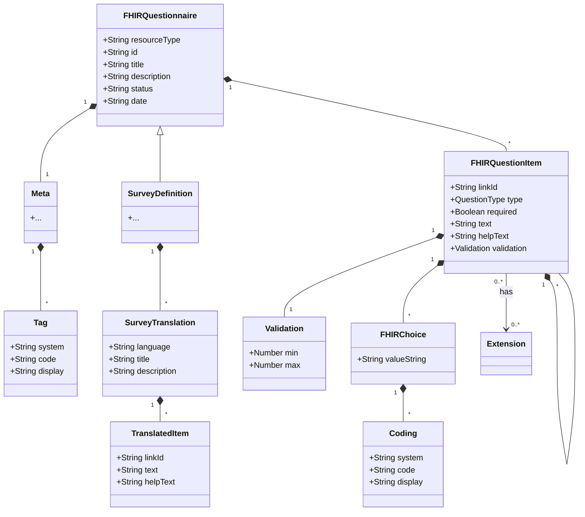

# Survey App Documentation

## Overview
The Survey App is a modern web application built with React and Chakra UI that provides a user-friendly interface for health risk assessment surveys. The application supports multiple languages and follows FHIR standards for healthcare data interoperability.

## Technical Architecture

### Data Structure
The application uses a FHIR-compliant data structure for surveys, with support for multiple languages and various question types.

#### Core Components
1. **Survey Definition**
   - Base FHIR Questionnaire structure
   - Support for multiple language translations
   - SNOMED CT coding for standardized medical terminology

2. **Question Types**
   - Boolean (yes/no)
   - Choice (single/multiple selection)
   - Text (free-form input)
   - Number (with validation)
   - SNOMED (standardized medical terms)

3. **Validation Rules**
   - Required field validation
   - Numeric range constraints
   - Custom validation rules per question type

### Class Structure


## User Interface Components

### Core Components
1. **Survey Container**
   - Manages survey state
   - Handles form submission
   - Controls navigation
   - Manages language switching

2. **Question Components**
   - ChoiceQuestion: Radio buttons and checkboxes
   - NumberQuestion: Numeric input with validation
   - TextQuestion: Free-form text input
   - BooleanQuestion: Yes/No selection
   - SNOMEDQuestion: Medical term selection

3. **Navigation Components**
   - Progress indicator
   - Previous/Next buttons
   - Language switcher
   - Save/Submit buttons

### UI/UX Considerations
1. **Accessibility**
   - ARIA labels for all interactive elements
   - Keyboard navigation support
   - Screen reader compatibility
   - High contrast mode support

2. **Responsive Design**
   - Mobile-first approach
   - Adaptive layouts
   - Touch-friendly controls
   - Readable text at all screen sizes

3. **User Experience**
   - Clear progress indication
   - Immediate validation feedback
   - Help text and tooltips
   - Smooth transitions between questions
   - Auto-save functionality

4. **Language Support**
   - Easy language switching
   - RTL language support
   - Culturally appropriate formatting
   - Consistent terminology across languages

## Development Guidelines

### Component Structure
```
src/
├── components/
│   ├── survey/
│   │   ├── SurveyContainer.tsx
│   │   │   ├── ChoiceQuestion.tsx
│   │   │   ├── NumberQuestion.tsx
│   │   │   ├── TextQuestion.tsx
│   │   │   ├── BooleanQuestion.tsx
│   │   │   └── SNOMEDQuestion.tsx
│   │   └── Navigation/
│   │       ├── ProgressIndicator.tsx
│   │       ├── NavigationButtons.tsx
│   │       └── LanguageSwitcher.tsx
│   └── common/
│       ├── HelpText.tsx
│       └── ValidationMessage.tsx
├── hooks/
│   ├── useSurveyState.ts
│   └── useValidation.ts
├── utils/
│   ├── validation.ts
│   └── translation.ts
└── types/
    └── survey.ts
```

### State Management
- React Context for global survey state
- Local state for form validation
- Redux for complex state interactions
- Persistent storage for auto-save

### Testing Strategy
1. **Unit Tests**
   - Component rendering
   - Validation logic
   - State management
   - Translation handling

2. **Integration Tests**
   - Form submission
   - Navigation flow
   - Language switching
   - Data persistence

3. **E2E Tests**
   - Complete survey flow
   - Error handling
   - Accessibility compliance
   - Cross-browser compatibility

## Getting Started

### Prerequisites
- Node.js 16+
- npm or yarn
- Modern web browser

### Installation
```bash
npm install
```

### Development
```bash
npm run dev
```

### Building
```bash
npm run build
```

### Testing
```bash
npm test
```

## Contributing
1. Fork the repository
2. Create a feature branch
3. Commit your changes
4. Push to the branch
5. Create a Pull Request

## License
MIT License - See LICENSE file for details 