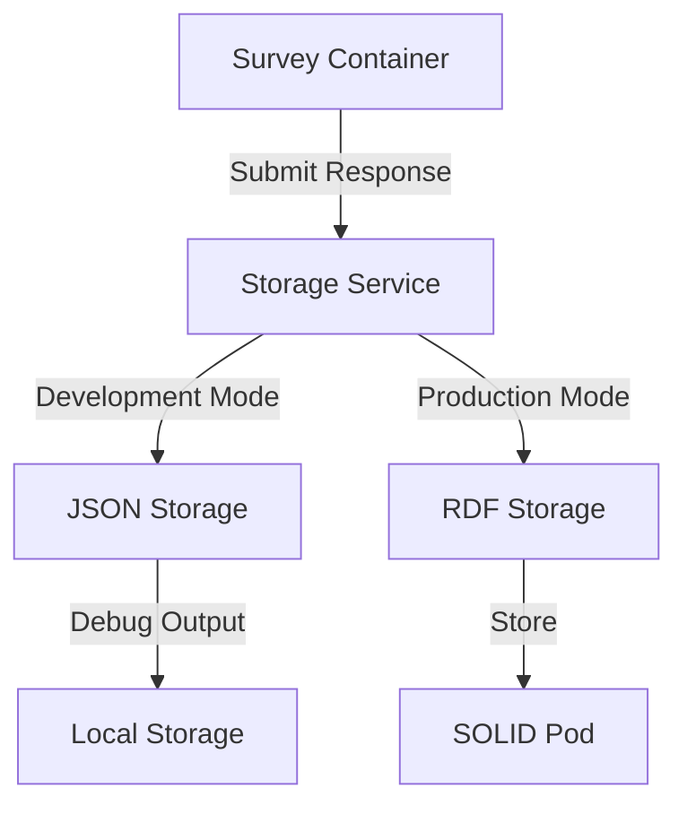

# Survey App Storage Architecture

## Overview

The Survey App implements a hybrid storage strategy that combines JSON-based debugging output with RDF-based final storage in the user's SOLID Pod. This architecture ensures both development flexibility and production-ready data storage.

## Storage Components

### 1. Debug Storage (JSON)
- **Purpose**: Development and debugging
- **Format**: FHIR-compliant JSON
- **Location**: Local storage
- **Use Cases**:
  - Development testing
  - Debugging survey responses
  - Offline development
  - Quick iteration

### 2. Production Storage (RDF)
- **Purpose**: Final data storage
- **Format**: FHIR-compliant RDF
- **Location**: User's SOLID Pod
- **Use Cases**:
  - Persistent storage
  - Data interoperability
  - Integration with other WellData apps
  - Long-term data retention

## Data Flow



## Implementation Details

### 1. URL Resolution
- **Purpose**: Handle questionnaire references
- **Features**:
  - Full URL support for external questionnaires
  - Local URL resolution for development
  - URL validation and normalization
  - Version control support

### 2. Conversion Service
- **Purpose**: Transform between JSON and RDF
- **Features**:
  - FHIR JSON to RDF conversion
  - RDF to FHIR JSON conversion
  - Validation of converted data
  - Error handling and reporting

### 3. Storage Service
- **Purpose**: Manage data persistence
- **Features**:
  - Mode-based storage selection
  - SOLID Pod integration
  - Local storage management
  - Error recovery
  - Data versioning

## Security Considerations

1. **Data Privacy**
   - User consent management
   - Data encryption in transit
   - Secure storage in SOLID Pod
   - Access control implementation

2. **Authentication**
   - SOLID authentication integration
   - Session management
   - Token handling
   - Secure credential storage

## Development Guidelines

### 1. Local Development
```typescript
// Example usage in development
const storageService = new StorageService({
  mode: 'development',
  debugOutput: true
});
```

### 2. Production Deployment
```typescript
// Example usage in production
const storageService = new StorageService({
  mode: 'production',
  solidPodUrl: userPodUrl
});
```

## Integration with WellData Ecosystem

The storage architecture is designed to integrate seamlessly with the broader WellData ecosystem:

1. **Data Sharing**
   - Controlled access to survey data
   - Integration with health records
   - Research data sharing (with consent)

2. **Interoperability**
   - FHIR compliance
   - RDF standards
   - SOLID protocol support
   - Cross-app data access

## Future Considerations

1. **Scalability**
   - Distributed storage options
   - Caching strategies
   - Performance optimization
   - Load balancing

2. **Extensibility**
   - Additional storage backends
   - Custom conversion rules
   - Enhanced validation
   - Advanced analytics

## Resources

- [FHIR Documentation](https://www.hl7.org/fhir/)
- [SOLID Protocol](https://solidproject.org/)
- [RDF Standards](https://www.w3.org/RDF/)
- [WellData Architecture](https://welldata.org/architecture) 