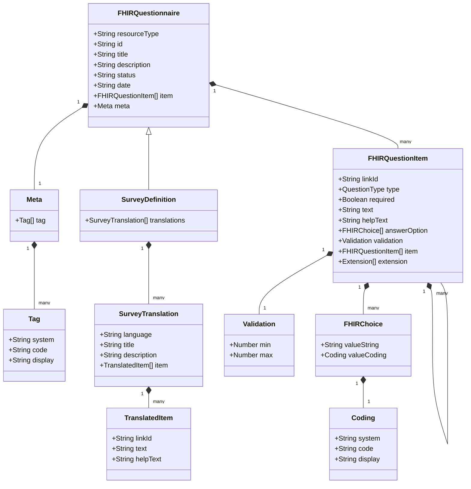

# Survey Structure

## Class Diagram



## Key Relationships

1. **FHIRQuestionnaire** is the base class that follows the FHIR standard
   - Contains metadata about the survey
   - Has a collection of questions (items)

2. **SurveyDefinition** extends FHIRQuestionnaire
   - Adds support for multiple language translations
   - Inherits all FHIR Questionnaire properties

3. **FHIRQuestionItem** represents individual questions
   - Can have nested questions (item array)
   - Supports different question types
   - Includes validation rules
   - Has answer options with SNOMED CT coding

4. **SurveyTranslation** provides language-specific content
   - Maps to the original questions via linkId
   - Contains translated text and help text
   - Maintains the same structure across languages

## Question Types

```typescript
type QuestionType = 'boolean' | 'choice' | 'text' | 'number' | 'snomed';
```

## Validation Rules

- Number questions have min/max constraints
- Required fields are marked with required=true
- Choice questions have predefined options with SNOMED CT codes

## Language Support

- Each survey can have multiple translations
- Translations maintain the same structure as the original
- Questions are linked via linkId for consistency 